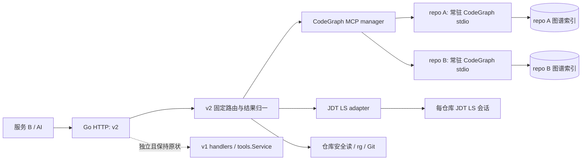
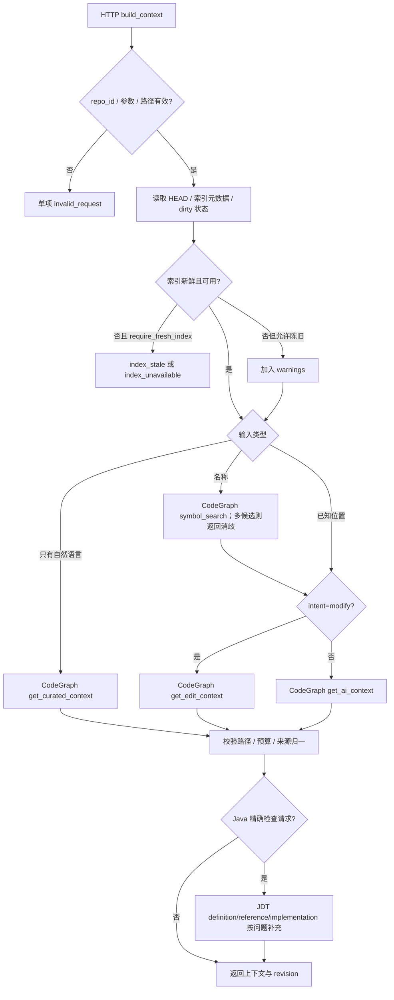

# Code Context v2：CodeGraph 主引擎与 JDT LS 精确语义补充

状态：实施设计。目标读者：负责改造本仓库的 Codex/工程师。日期：2026-09-23。

## 1. 目标、边界与依据

现有 Go HTTP 服务向服务 B 提供 v1 批量工具。v2 的首选入口是一次调用取得可用于 AI 推理或修改的代码上下文；代码搜索、调用关系、影响分析和上下文选择尽量交给 CodeGraph 的持久化图谱。JDT LS 仅在 Java 类型绑定和精确位置导航上补充结果。所有 v1 URL、Schema、请求/响应、行为、默认值、错误与仓库端点保持原样；v2 作为平行接口加入。

已核对的 CodeGraph 官方能力：MCP stdio 启动、`--workspace`、`--profile`、`codegraph_get_curated_context`、`codegraph_get_ai_context`、`codegraph_get_edit_context`、`codegraph_analyze_impact`、`codegraph_get_call_graph`、`codegraph_symbol_search`、`codegraph_pr_context`、`codegraph_reindex_workspace`、`codegraph_index_files`、`codegraph_index_directory`。工具完整列表见 [MCP 包文档](https://github.com/codegraph-ai/CodeGraph/blob/main/mcp-package/README.md)，工具用途见 [项目 README](https://github.com/codegraph-ai/CodeGraph/blob/main/README.md)。官方示例说明 `get_ai_context` 使用 `uri`、零基 `line`、`intent`，`pr_context` 使用 `baseBranch`。其余精确输入 Schema、响应结构必须在锁定版本启动后从 MCP `tools/list` 读取并做契约测试，本文不假定未公开字段。CodeGraph 版本和二进制校验和由部署固定，不使用浮动 `latest`。

**第一阶段不做**：修改或重写 v1；自研知识图谱、调用图、图遍历、复杂 Context Builder/排序器；向 CodeGraph 图谱写入 JDT LS 结果；要求两个索引互写；让 AI 直接控制 CodeGraph 索引或执行任意 MCP 工具。v2 对 CodeGraph 响应只做路径校验、格式归一、预算截断和少量固定路由。

## 2. 现有代码与落点

| 现有模块 | 已有职责 | v2 改造位置 |
| --- | --- | --- |
| `internal/api/server.go` | `/v1/tools` Schema、批量工具、`/v1/repositories`、超时 | 保留原函数及 v1 注册；在独立 `internal/api/v2.go` 注册 `/v2/tools`、`/v2/tools/{name}` 和 v2 仓库状态/刷新 |
| `internal/tools/service.go` | v1 的 rg、JDT、Git、文件、调用图 BFS；`SyncAndWarm`、`Refresh`、`Status` | 保持 v1 行为；新增 `internal/v2/service.go`，注入既有 `tools.Service` 的安全读/Java 语义能力与 CodeGraph adapter |
| `internal/lsp/jdt.go`、`internal/lsp/client.go` | 每仓库 JDT 会话与 LSP 调用 | v2 复用；不要改动 v1 可观察行为；修复任何生命周期问题须有 v1 回归依据 |
| `internal/repository/manager.go` | 配置仓库、路径防逃逸、仓库相对路径 | v2 统一复用 `Get`/`File`；CodeGraph 返回路径也须反向校验落在该仓库内 |
| `internal/config/config.go` | YAML 子集/JSON 解析、默认值 | 增加 CodeGraph 配置解析及校验；更新 YAML 子集解析器，不只改结构体 |
| `cmd/code-context/main.go` | 同步 Git、预热 JDT、启动 HTTP、关闭服务 | 创建 CodeGraph manager，按配置预热/延迟启动，关停时关闭所有 MCP 子进程 |
| `code-context/references/http-api.md` | 服务 B 的 v1 使用参考 | 保留 v1 内容；新增 v2 参考并调整 Skill 默认入口，灰度期间可回退 v1 |

目前 `SyncAndWarm` 在监听前依次 `git pull --ff-only` 并预热所有 JDT；v1 的 `/refresh` **仅**关闭 JDT 会话，并未同步 Git。v2 索引刷新必须独立编排，不应通过改变这两个 v1 行为实现。`ToolRequest` 已含 `base`、`head`、`staged` 但 v1 没有对应 change 工具；v2 使用独立请求结构。`trace_call_path` 当前在 Go 中调用 JDT 调用图并 BFS；此实现只留给 v1 兼容。

## 3. 架构与职责



- **CodeGraph**：自然语言跨代码库检索、已定位符号的意图上下文、修改上下文、调用图和影响分析、PR 上下文、索引。
- **JDT LS**：Java 精确 definition、references、implementation/override、type hierarchy；复杂重载、接口实现、多模块类型绑定的人工/AI 确认入口。`find_overrides` 现实现为 LSP `textDocument/implementation`，它不等于完整“覆写”语义；v2 名称保留兼容含义并在响应中标明 `operation=implementation`。
- **Go/rg/Git**：受控仓库解析、仓库相对路径、原文/正则搜索、文件读取和列表、只读 Git 查询、revision 检测、HTTP 限制。绝不从 CodeGraph 结果推导“精确”Java 绑定。

v2 对 AI 展示高阶工具优先；精确/底层工具在 Schema 中仍可发现，但服务 B Skill 只在高阶结果不足、用户要求精确位置或 CodeGraph 失效时调用。Go 接口与 MCP 工具是映射关系，不是一比一透传。

## 4. v2 API 约定

统一使用 `GET /v2/tools`（返回 v2 工具 Schema）、`POST /v2/tools/{name}`，请求体 `{"requests":[...]}`，批次上限沿用配置值；`results[i]` 顺序对应 `requests[i]`。为避免单项变慢拖累整批，服务 B 的默认调用每批一项；并发由服务端限流。v2 单项成功格式为 `{"data":...,"truncated":false,"warnings":[],"meta":{...}}`，失败为 `{"error":{"code":"...","message":"...","retryable":false},"truncated":false,"warnings":[],"meta":{...}}`。JSON 解析/批次错误用 HTTP 4xx；单项工具错误留在 `results[i]`。对空结果须区别 `no_match`、`index_unavailable`、`index_stale`。v2 的 `limit`、`token_budget` 设置上限，超限报 `invalid_request`，不悄悄扩大成本。

通用 `meta`：`repo_id`、`source`（`codegraph|jdtls|rg|git|composite`）、`repo_revision`（查询前 `git rev-parse HEAD`）、`index_revision`（服务端记录的最后一次**成功完成** CodeGraph 索引对应 commit；没有则 `null`）、`index_state`（`ready|stale|building|unavailable|unknown`）、`indexed_at`（有记录时）、`duration_ms`。`index_revision` 是 Go 层写入的管理元数据，**不宣称 CodeGraph 原生提供 Git revision**；仅在索引操作前后 HEAD 一致且索引成功时推进。工作区非干净时另给 `working_tree_dirty=true` 和 `working_tree_unindexed` 警告。响应可记录 `codegraph_version` 与 `tool_schema_fingerprint` 用于诊断。

### 4.1 AI 默认高阶工具

| v2 名称 | 请求用途 | 主实现与固定映射 |
| --- | --- | --- |
| `build_context` | 自然语言问题、已知符号 explain/debug/test/modify | 自然语言无位置 → `codegraph_get_curated_context`；已知 `symbol` → `codegraph_get_ai_context`；`intent=modify` 且有位置 → `codegraph_get_edit_context`。仅按规则选择现成工具，不在 Go 中重排图谱 |
| `impact` | “修改/删除/重命名此符号影响哪里” | 已定位符号 → `codegraph_analyze_impact`；Java 精确性必要时另调用 JDT 引用/实现并在 `precision_checks` 并列呈现 |
| `change_context` | 提交、分支或工作树变更的整体上下文 | 固定的 Git diff 元数据 + CodeGraph `codegraph_pr_context`（官方确有此工具）；若安装版本不支持所需 diff 范围，只接受可验证的 `base_branch`/HEAD 场景，其他场景返回 `unsupported_change_scope`，不自行实现 PR 影响图 |

`build_context` 是首选，一次 HTTP 调用内部通常只产生一次 CodeGraph 上下文工具调用。必要的符号消歧可先调 `codegraph_symbol_search`，然后再调上下文工具；最多两次，且返回 `ambiguous_symbol` 候选供调用方选择，不能擅自拿第一个重载。Java 精确检查只在 `precision=java_exact` 或明确的接口/重载/override 问题触发，不默认对每次问答启动 JDT。

### 4.2 精确与底层工具

| v2 名称 | 主实现 | AI 暴露建议 |
| --- | --- | --- |
| `find_definition`, `find_references`, `find_overrides`, `get_type_hierarchy` | JDT LS；仅 Java，要求 file/line/column | 是，精确导航时 |
| `get_call_graph` | `codegraph_get_call_graph`，按其 Schema 映射 location/depth/direction | 是，高阶不足时；标 `precision=structural` |
| `search_symbols` | `codegraph_symbol_search` | 是，消歧时 |
| `get_file_symbols` | JDT LS `documentSymbol`，仅 Java | 有条件；Java 文件结构 |
| `search_text` | 既有 rg `Search`，保留正则、globs、context_lines | 有条件；字符串/正则问题 |
| `read_file`, `list_files`, `git_query` | 既有安全文件/Git 实现 | 有条件；原文和提交事实 |

所有高阶与 CodeGraph 底层输出均带来源；CodeGraph 的调用/影响结果为图谱结构结论，不标 `exact`。`read_file` 返回实时磁盘内容，不能混作 CodeGraph 已索引内容。`git_query` 沿用只读命令白名单和输出大小上限；不要新增任意 shell 接口。

### 4.3 `build_context` 请求与响应

```json
{
  "requests": [{
    "repo_id": "order-service",
    "intent": "explain",
    "question": "订单取消后的退款是怎么触发的？",
    "symbol": null,
    "token_budget": 6000,
    "precision": "auto",
    "require_fresh_index": true
  }]
}
```

`intent`：`explain|debug|test|modify`；必填。`question` 为自然语言，`symbol` 可以是 `{ "file":"src/.../OrderService.java", "line":42, "column":16 }` 或 `{ "name":"com.acme.OrderService.cancel" }`，两者至少一个；已给 file/line/column 时三个字段均必填，位置按 HTTP 的 **1 基**。名称命中多个候选时返回 `ambiguous_symbol`、候选位置与签名，客户端再次提交位置。`token_budget` 默认 6000、最大值配置如 12000；适配器仅向 CodeGraph 传其**实测支持**的预算参数，输出超预算时按可分段结构边界截断并设 `truncated=true`、`budget_exhausted`，不得剪断 JSON。`precision=auto|java_exact`；后者只适用于已定位的 Java 符号。`require_fresh_index` 默认为 true；false 允许带明确陈旧警告的降级结果。

```json
{
  "results": [{
    "data": {
      "intent": "explain",
      "answer_context": "按 CodeGraph 返回的结构化上下文归一后的文本/片段",
      "focus": {"name":"cancel", "file":"src/.../OrderService.java", "line":42, "column":16, "source":"codegraph"},
      "related": [{"role":"caller", "name":"cancelOrder", "file":"src/.../OrderController.java", "line":31, "source":"codegraph"}],
      "precision_checks": [],
      "provenance": [{"tool":"codegraph_get_curated_context", "source":"codegraph"}]
    },
    "truncated": false,
    "warnings": [],
    "meta": {"repo_id":"order-service", "source":"codegraph", "repo_revision":"<sha>", "index_revision":"<sha>", "index_state":"ready", "duration_ms":115}
  }]
}
```

`answer_context` 是供 AI 消费的上下文，不生成最终答案；`related` 只提取 CodeGraph 实际返回且能校验的字段，不虚构调用边或风险评分。每段片段含文件相对路径、行号、来源；MCP 原始内容可以在受控 `raw_context` 可选字段返回（受预算及脱敏约束），以免丢失 CodeGraph 新增字段。warnings 可为 `index_stale`、`working_tree_unindexed`、`codegraph_unavailable`、`jdtls_unavailable`、`partial_context`、`budget_exhausted`、`unsupported_capability`。`precision_checks` 是独立 JDT 区块，绝不与 CodeGraph 结构边混成单一“精确图”。

### 4.4 `impact` 与 `change_context`

`impact` 请求：`repo_id`、`symbol`（位置必填；名称需先消歧）、`change_kind=modify|delete|rename`（仅当实际 MCP Schema 支持时映射；不支持则仅传已确认字段并在响应给 `unsupported_capability`）、`precision=auto|java_exact`、`token_budget`、`require_fresh_index`。响应保留 CodeGraph 原生影响分组/证据与 `provenance`，并列 `precision_checks`、warnings、revision；不在 Go 中重算 blast radius。无法可靠映射 change_kind 时拒绝对应类型，不能把 rename 静默当 modify。

`change_context` 请求：`repo_id`、`base_branch`（受控 ref，例如 `origin/main`）、可选 `head=HEAD`、`format=json|markdown`、`token_budget`、`require_fresh_index`；第一阶段不支持任意 PR URL、远端拉取、`staged=true` 或自定义任意 `head`。先检查 `git rev-parse` 可解析 base 与 HEAD、diff 大小限制，再调用 `codegraph_pr_context` 的 `baseBranch`，并按 `tools/list` 验证 `format`。响应含 `change_scope`、CodeGraph 原生 `pr_context`、`repo_revision`、`index_revision`、warnings。若调用方只要差异原文，使用 `git_query`；不要把 CodeGraph 的 PR 总结冒充 Git diff 全文。

## 5. 逐项 v1 → v2 规划

表中 v1 状态均为**原样保留**，包括既有参数与响应；“AI”指 v2 Skill 默认是否展示/推荐。

| v1 工具 | v2 保留/名称 | v2 主实现 | AI | 迁移与兼容说明 |
| --- | --- | --- | --- | --- |
| `search_code` | 是，`search_text` | rg/现有 `Service.Search` | 条件 | v1 正则语义不适合作自然语言；自然语言改用 `build_context` |
| `find_definition` | 是，同名 | JDT LS | 是 | Java 精确位置；非 Java 返回 `unsupported_language` |
| `find_references` | 是，同名 | JDT LS | 是 | 同上；精确引用与 CodeGraph 图谱结果分开 |
| `find_overrides` | 是，同名 | JDT LS | 是 | 现实现是 `textDocument/implementation`；v2 明示该语义，复杂覆写不可假称完整 |
| `get_type_hierarchy` | 是，同名 | JDT LS | 是 | Java 类型层级；复用现有深度/结果限额 |
| `get_call_graph` | 是，同名 | CodeGraph | 条件 | v2 为图谱结构结果，响应格式与精度标记可不同于 v1 JDT 图；不得复用 v1 BFS |
| `trace_call_path` | 否，v1 仅兼容 | v1 既有 JDT+BFS | 否 | CodeGraph 公布的工具中无确定的最短路径接口契约；v2 不自研图遍历。需要调用链用 `get_call_graph`/`build_context`，不得谎称等价 |
| `search_symbols` | 是，同名 | CodeGraph | 条件 | v2 返回图谱符号候选；精确 Java 导航随后用 JDT |
| `get_file_symbols` | 是，同名 | JDT LS | 条件 | 仅 Java；其他语言从 `build_context`/CodeGraph 检索 |
| `get_symbol_context` | 否，v1 仅兼容 | v1 既有 hover+definition+读取 | 否 | v2 用 `build_context(symbol,intent=explain)`；两者响应不等价 |
| `read_file` | 是，同名 | Go 现有 `Service.Read` | 条件 | 只读实时文件，保留路径防逃逸和字节上限 |
| `list_files` | 是，同名 | Go 现有 `Service.ListFiles` | 条件 | 目录枚举；不承担知识检索 |
| `git_query` | 是，同名 | Git/现有 `Service.GitQuery` | 条件 | 保留只读白名单；为变更原文提供事实依据 |

v1 的 `limit` 等字段保持现状；v2 仅接受各工具实际使用的字段，并明确 Schema。v1 的 `get_call_graph` 与 v2 同名但不同语义和数据形状，服务 B 不得复用 v1 的解析器。v2 不提供 `trace_call_path`/`get_symbol_context` 对应端点；旧调用继续走 v1。v2 可新增 `GET /v2/repositories/{repo_id}/status` 和 `POST /v2/repositories/{repo_id}/refresh-index`，与 v1 repository 路由分离。

## 6. `build_context` 主流程



自然语言问题一次请求只调用 `get_curated_context`。已知位置一次调用 `get_ai_context` 或 `get_edit_context`。明确的名称查找至多先做 `symbol_search`；多候选时终止并返回候选。Go 不把 `get_call_graph`、`read_file`、`search_symbols` 串成通用自制 Context Builder。JDT 查询失败时，如已有可用 CodeGraph 结果且 `precision=auto`，返回 `partial_context` 与警告；`java_exact` 则单项失败，不能宣称满足精确性。

## 7. MCP 接入与运行

1. **安装/配置**：部署固定版本 `@astudioplus/codegraph-mcp` 或官方 engine binary；`codegraph-mcp` 自带 MCP stdio 启动方式，engine 直接启动需 `--mcp`。两者择一并在配置中明确，不同时传重复 transport 参数。配置示意：`codegraph.enabled`、`command`、`args`、`workspace_data_root`、`startup_timeout`、`call_timeout`、`max_concurrent_per_repo`、`max_processes`、`reindex_on_start`、`telemetry`、`index_max_age`。配置 parser、示例和打包脚本同步更新；若运行时需要 npm/engine，Dockerfile 和 Ubuntu 包应安装或随包提供，并校验 checksum。生产环境建议设置 `CODEGRAPH_TELEMETRY=off`，除非部署方明确启用；此开关见官方 MCP 文档。
2. **进程隔离**：每个受控 `repo_id` 对应一个常驻 stdio 进程，工作目录/`--workspace` 均为 `repository.Manager` 解析出的真实仓库根。索引数据目录需按 repo ID 隔离并由配置指定/验证；先确认固定版本的实际数据目录选项或环境变量，不存在隔离能力时每仓库进程使用独立 `HOME`/XDG 数据目录或容器。禁止两个进程同时写同一索引。限制总进程数/内存；超出时 LRU 停止空闲进程或拒绝新仓库，不能跨仓共享进程或索引。
3. **MCP 协议**：`internal/codegraph/client.go` 实现 JSON-RPC stdio 帧、initialize/initialized、`tools/list`、`tools/call`、请求 ID 关联与取消；或引入维护中的 Go MCP SDK，优先复用 SDK。`stdout` 只解析协议，`stderr` 写有上限的日志。启动后验证所需工具名与输入 Schema，记录 fingerprint；若缺少 `get_curated_context`、`get_ai_context`、`get_edit_context`、`analyze_impact`、`get_call_graph`、`symbol_search`、`pr_context`、`reindex_workspace`，对应 v2 功能标记 unavailable，不做未知工具调用。按运行时 Schema 映射参数，并用固定版本契约测试锁住映射。不得把 HTTP 任意字段直接透传 MCP。
4. **生命周期/并发**：manager 对每仓库 singleflight 启动和索引；连接复用，单次工具调用有子超时，HTTP context 取消须取消 MCP 请求或在超时后丢弃响应；每仓库有有界 semaphore，队列满返回 `busy`。进程退出时标记不可用、清理未完成请求，指数退避重启（限制频率）；成功重新握手后才服务。关停先停止接收请求，等待在途请求，随后关闭/终止每个 CodeGraph 子进程，再沿用现有 JDT 关停。
5. **索引与 revision**：`POST /v2/repositories/{id}/refresh-index` 为受控管理端点，调用 `codegraph_reindex_workspace` 并串行化；小范围文件变更可内部调用 `codegraph_index_files`，但只有可证明变更范围时使用。开始前读取 HEAD/dirty，结束后再读 HEAD/dirty；仅两次 HEAD 一致、无未索引改动且工具成功时设置 `index_revision=HEAD`、`index_state=ready`。Git 同步完成后应触发重建/增量索引；现有 v1 `/refresh` 仍只刷新 JDT，不承担 CodeGraph 同步。启动可先服务 v1；v2 在索引完成前返回 `building`，避免 CodeGraph 慢启动拖住原有服务。多模块 Java 项目以同一个仓库根索引 CodeGraph，JDT 保持现有每仓库 workspace。
6. **安全与观测**：只允许配置中的仓库；对 HTTP 位置先用 `Repos.File`，转换为 `file://` URI 时正确转义，HTTP 1 基转换为 CodeGraph 0 基（按工具 Schema 确认）与 JDT 0 基。CodeGraph 返回的 file URI 必须落在相应仓库下，拒绝 `..`、符号链接逃逸、其他仓库路径。CodeGraph 属于本地可执行程序，运行身份最小权限，索引目录不可由 HTTP 指定；限制响应大小、token 数、stderr 长度。日志记录 tool、repo_id、耗时、状态、revision/索引滞后，不记录代码正文、自然语言问题或文件绝对路径。指标：调用成功率/时延、重启次数、索引耗时、索引落后、降级次数、预算截断。

## 8. 失败与降级规则

| 情况 | v2 行为 |
| --- | --- |
| CodeGraph 进程/工具不可用 | 高阶接口若无已有可用结果，返回 `index_unavailable`/`codegraph_unavailable`，`retryable=true`；`search_text`、JDT 和文件/Git 工具继续可用。不要自动拼装低层工具冒充完整上下文 |
| 当前 HEAD 与 `index_revision` 不同 | 默认高阶接口返回 `index_stale`，建议先刷新索引；调用方显式 `require_fresh_index=false` 时可返回旧图谱内容并附警告与两个 revision |
| 工作区有未索引变更 | 不标记 ready；默认拒绝高阶结论或先经受控索引完成；允许陈旧时显式 `working_tree_unindexed` |
| JDT 不可用 | 高阶 `auto` 若 CodeGraph 完成则返回部分结果与警告；`java_exact` 和 JDT 精确工具返回 `jdtls_unavailable` |
| CodeGraph 工具不存在/Schema 变化 | 对应能力 `unsupported_capability`；启动诊断可见，禁止猜字段或静默换成语义不同的工具 |
| CodeGraph 返回超预算或超时 | 前者保留可验证片段、设 `truncated`；后者返回 `timeout`，需要时客户端可用 `search_text`/`read_file` 做显式人工降级 |

`/readyz` 目前与 `/healthz` 相同；不要改变 v1 部署对它的含义。v2 的仓库状态端点独立提供 `codegraph_state`、`index_revision`、`repo_revision`、`jdtls_active`。灰度时可关闭 `codegraph.enabled` 或让服务 B Skill 回退 v1；不需要回滚 v1 的二进制接口。

## 9. 实施步骤（按顺序交给 Codex）

1. **基线与结构**：记录 v1 Schema、路由和关键响应快照；新增 `internal/api/v2.go`、`internal/v2`、`internal/codegraph`，v1 switch/handler 保持原样。先定义 v2 DTO、错误码、Schema 与 JSON 示例。
2. **依赖和配置**：锁定 CodeGraph release/校验和；更新 `config.Config` 与 YAML 子集 parser、`config.yaml` 示例、Dockerfile/打包脚本和 README。配置有效但 CodeGraph 未安装时，v1 仍能启动；v2 状态明确 unavailable。
3. **CodeGraph adapter**：完成 stdio MCP 握手、`tools/list` 契约校验、按 repo 隔离、超时/取消、并发限流、重连/关闭；以固定版本真实响应写适配器 fixture。不要把具体响应字段凭空写进 Go 结构体。
4. **索引管理**：提供刷新端点、成功索引 revision 记录、HEAD/dirty 检查、状态、串行化；处理 Git pull 后索引顺序。索引元数据持久化需原子写入，服务重启后再核对 Git HEAD 和索引目录，不因旧 metadata 自动宣称 ready。
5. **v2 路由**：先接通 `build_context`，随后 `impact`、`change_context`；再开放 CodeGraph 调用图/符号与 JDT/rg/Git 底层工具。按第 4 节做来源和路径归一、预算控制、warnings。
6. **服务 B 指引**：新增 `code-context/references/http-api-v2.md`，将 `code-context/SKILL.md` 默认流程改为 `build_context` → 必要时 `impact`/精确查询，保留 v1 参考和显式回退说明。不要让 AI 默认看到完整 42 个 CodeGraph MCP 工具。
7. **验证与灰度**：先以固定版本 CodeGraph + 小型 Java 多模块仓库做集成验证，再按仓库/服务 B 配置灰度开启 v2；观测延迟、索引滞后、失败与降级，达到验收条件后扩大流量。回滚关闭 v2/CodeGraph 配置和恢复旧 Skill 默认入口，v1 继续可用。

## 10. 验收与测试用例

| 用例 | 输入与检查点 | 通过条件 |
| --- | --- | --- |
| v1 回归 | 13 工具 Schema/端点/成功及失败样例、`/v1/repositories` | 与基线一致；尤其批量结果顺序、错误、`trace_call_path`、刷新行为不变 |
| 自然语言问题 | `build_context(intent=explain,question="退款如何触发")` | 走 `get_curated_context`；一次 HTTP 请求，返回来源、可定位片段、revision，不要求客户端多轮搜索 |
| 已知 symbol explain | Java file/line/column、`intent=explain` | 走 `get_ai_context`；1 基/0 基换算正确，返回聚焦符号与相关上下文 |
| 修改上下文 | 已知位置、`intent=modify` | 走 `get_edit_context`；含工具实际返回的调用方/测试等内容，不自编造 |
| 影响分析 | 已知符号、modify/delete/rename | 走 `analyze_impact`；不支持的操作明确报错；来源与精度可见 |
| Java interface/override | 接口方法和实现位置、`precision=java_exact` | JDT `definition/references/implementation/typeHierarchy` 被正确调用；与 CodeGraph 结果并列 |
| Java 重载 | 同名不同参数方法，仅给 name | 返回多个候选并要求位置消歧；不能静默选首项 |
| 多模块 | 同仓库两个 Maven/Gradle 模块的跨模块符号 | CodeGraph 索引覆盖仓库，JDT 定义/引用能确认；跨仓库内容被拒绝 |
| CodeGraph 故障 | 杀进程、无工具、超时 | 高阶返回明确可重试错误或已授权的部分结果；v1 和 JDT/rg/Git 可用；重连有上限 |
| 索引滞后 | 索引成功后改变 HEAD | 默认返回 `index_stale`；显式允许时 warnings 中含 revision 差异；刷新成功后 ready |
| dirty 工作树 | 不提交地改源文件 | 不将旧索引标 ready；含 `working_tree_unindexed`，实时读文件与图谱内容分清 |
| 安全与预算 | `../`、跨仓 file URI、超大响应、超预算 | 拒绝越界路径；截断有标记且 JSON 有效；不记录源码/问题正文 |
| PR/变更 | `base_branch=origin/main`、HEAD | `pr_context` 与可解析 Git ref 对齐；不支持 staged/任意 head 时显式拒绝 |

契约测试启动固定的 CodeGraph 二进制，先读 `tools/list`，验证请求字段、工具名和真实响应；不允许 mock 断言代替唯一的集成验证。v1 回归可复用 `internal/api/server_test.go`、`internal/tools/service_test.go`，新测试分别置于 `internal/codegraph`、`internal/v2` 和 API v2 测试文件。文档交付本身只改 Markdown，代码和测试在实施阶段执行。

## 11. 实施完成定义

`/v2/tools` 与服务 B v2 参考一致；三项高阶能力在固定 CodeGraph 版本上跑通；索引 revision 可审计且陈旧时不会输出无警告的肯定结论；Java 精确结果来源清晰；13 项 v1 回归不变；README、配置样例、打包/部署和回滚步骤可直接执行。任何 CodeGraph 工具的缺失或 Schema 差异必须在实现记录中列出，并以实际可用能力收敛对应接口，而不是编造替代工具。
